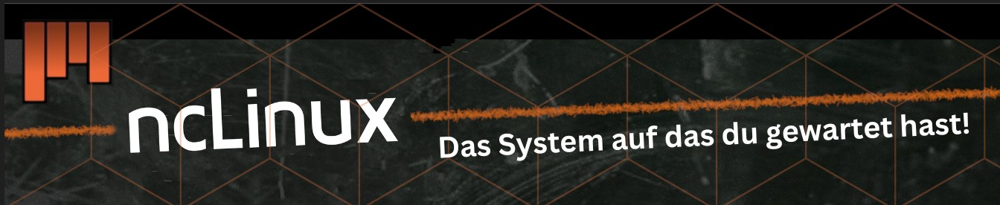

# ncLinux
Die optimierte, auf Ubuntu basierende Distribution, die dir bei der Arbeit mit Linux Zeit spart

## Beschreibung
Im Abschlussprojekt des ZLI Zürichs entschied ich mich dazu meine eigene Ubuntu basierte Distribution namens ncLinux zu erstellen.

ncLinux ist eine neue Linux Distribution, die auf die Arbeit der Plattformentwickler 
abgestimmt ist. Diese Distribution, nimmt Plattformentwickler beim Erstellen von VMs Arbeit ab, weil die wichtigsten 
Programme und Pakete schon mit der Installation der Distribution mitgeliefert werden. 

ncLinux basiert auf apt, dem Ubuntu Linux Paketmanager, der den Zugriff auf eine Vielzahl von Paketen aus den Ubuntu Repositories ermöglicht.

## Vorinstallierte Programme auf dem System
- wireshark
- sudo (Vorinstalliert)
- cowsay
- git
- docker
- kubernetes
- Visual Studio Code
- openssh-server
- Apache Webserver (Paketname: apache2)
- NGINX Webserver (Paketname: nginx)
- chrome
- net-tools 
- nmap
- traceroute
- tree
- neofetch
- gcc
- OpenVM-Tools

## Installationsanleitung für eine virtuelle Maschine mit ncLinux-V3.iso

Diese Anleitung führt dich durch den Prozess der Erstellung einer virtuellen Maschine (VM) mit ncLinux-V3.iso auf dem Betriebssystem "ncLinux" basierend auf Ubuntu. Befolge die unten stehenden Schritte, um die VM erfolgreich einzurichten.

### Voraussetzungen:
- Eine Virtualisierungssoftware wie [VirtualBox](https://www.virtualbox.org) oder [VMware](https://www.vmware.com) installiert.

### Empfohlene Spezifikationen für die virtuelle Maschine (VM)

- **Arbeitsspeicher (RAM):** Mindestens 4 GB RAM (empfohlen: 6 GB oder mehr).
- **Prozessor:**
  - empfohlen: 4 physische Kerne 2 Processors / 2 Cores.

- **Festplattenspeicher:** Mindestens 35 GB freier Festplattenspeicher (Empfohlen 45 GB oder mehr ).
- **Netzwerkinterface:** NAT.
- **Virtualisierungssoftware:** Aktuelle Version von VirtualBox, VMware oder einer anderen Virtualisierungssoftware, die mit dem Betriebssystem "ncLinux" kompatibel ist.

### Schritt 1: ISO-Image herunterladen

1. Klicke beim ISO-File in diesem Verzeichnis auf Download und speicher die Datei auf deinem System ab

### Schritt 2: Virtuelle Maschine erstellen

1. Öffne deine Virtualisierungssoftware ([VirtualBox](https://www.virtualbox.org) oder [VMware]) auf deinem "ncLinux"-Computer.
2. Klicke auf "Neu erstellen" oder eine ähnliche Option, um eine neue virtuelle Maschine zu erstellen.
3. Vergib einen Namen für die VM (z.B. "Meine VM") und wähle den Maschinentyp entsprechend den Anforderungen.
4. Weise der VM ausreichend Arbeitsspeicher, Prozessorkerne und Festplattenspeicher zu.
5. Wähle das heruntergeladene ISO als Installation Image 
6. Stelle sicher, dass alle Einstellungen deinen Anforderungen entsprechen und erstelle die VM.

### Schritt 3: Installation von ncLinux

1. Starte die VM, entweder durch Klicken auf "Starten" oder eine ähnliche Option.
2. Die Installation von ncLinux sollte automatisch starten. Befolge die angezeigten Anweisungen, um Spracheinstellungen, Partitionierung, Benutzerdetails usw. festzulegen.
4. Warte, bis die Installation abgeschlossen ist. Dies kann einige Zeit in Anspruch nehmen.
5. Starte die VM neu, nachdem die Installation abgeschlossen ist.

Herzlichen Glückwunsch! Du hast erfolgreich ncLinux in einer virtuellen Maschine installiert.

Ich hoffe, dass diese Installationsanleitung hilfreich für dich ist. Wenn du Fragen, Probleme oder eine Rezension hast, zögere nicht, und schreibe mir auf Discord 

**Discord Name:**
- dusky5

